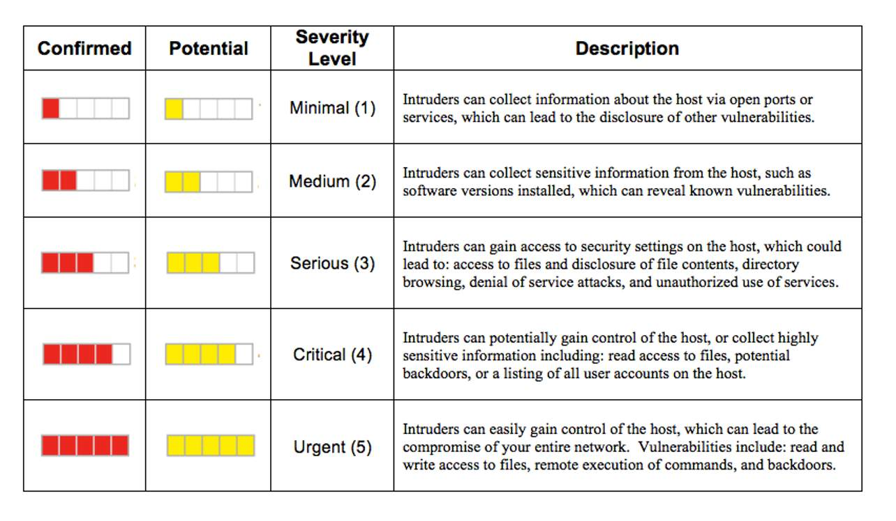

# Al Lizaso STEP-2 Program Week 1 Log

## Monday 06/10
* Arrived at the University of Illinois, Urbana-Champaign
* Got settled into my office in the NCSA building
* Met with my mentors from the NCSA security team: Jacob Gallion and Chris Clausen
* They assigned some reading material on Qualys, Elastic, Splunk, and AWS Security Training
* Attended a team meeting to learn more about how these programs are used at NCSA

## Tuesday 06/11
* 9AM: STEP-2 check-in meeting with Dave Wheeler
* 10AM: Worked on **Qualys Vulnerability Management - Foundation**
  * The primary objectievs of VM are to change software configurations to make it less susceptible to attacks, enable the effective mitigation and management of security risks, and to indicate the most effective workflow for patching and updating your devices to thwart attacks
  * Attackers target victims by first exploiting trusted entities
  * Sources of vulnerabilities: programming mistakes, bugs, hardware/devices, and unclosed ports
  * Cloud based scanners require no installation and can scan the perimeter of your network
  * Your manager has asked you to scope your organization's assets. You should begin with internet-facing assets
  * Vulnerability Management (VM) means systematically and continuously finding and eliminating vulnerabilities in your computer system
  * Asset scoping is the process of organizing the computer systems according to their role in a business that establish an evaluation baseline. This process is also known as asset discovery
  * Cloud-based VM solutions area an ideal option for continuous vulnerability assessment. Some merits of using cloud-based VM solutions: low maintenance, fast implementation, pay-as-you-go, and it updates automatically
  * The factors to be considered while choosing VM are: deployment, management, design, and compliance
  * The shelf life of a vulnerability identified by a consultant is significantly less. Results are valid only until the environment changes or until new threats arise. Results are accurate for a day at best
  * Advantages of using a commercial, cloud-based solution: grows with your business, automate as much as you can, use solid, safe technology
  * Users access Qualys VM via a web browser. Users can immediately use the service and audit the security of their external and internal networks. Qualys VM:
    1. Discovers all systems attached to your network
    2. Identifies and analyzes vulnerabilities on all discovered systems
    3. Reports findings of discovery and vulnerability analysis
    4. Shepherds the vulnerability remedation process
    5. Confirms that remedies or workarounds have been applied
    6. Provides documentation to verify security compliance
    7. Automatically repeats the VM-for-continuous-protection steps
    8. Alerts on variances from expected configruations in vulnerabilities, exposed services, installed software, and certificates
  * Qualys VM KnowledgeBase is the continuously updated and comprehensive database of vulnerabilities signatures
  * Qualys Security Operations Centers (SOCs) - the vulnerability data detected by Qualys sensors using the KnowledgeBase is stored in the Qualys platform
  * Qualys VM Internet scanners carry out perimeter scanning for customers. They begin by building an inventory of protocols found on each machine undergoing an audit. Then, the scanner detects which ports are attached to services. At that point, the scanners initiate an inference-based vulnerability assessment based on vulns that could be present to identify actual vulns and quickly minimize false positives
  * Qualys VM Scanner Appliances map domains and scan IPs behind the firewall. These are virtual or physical devices that gather security audit data in the firewall and communicate securely with Qualys SOCs. These devices poll the SOCs for software updates and new vuln signatures and process job requests
  * Threat protection is methods and solutions that enhance an organization's defenses against cyber threats such as malicious code, bot attacks, DDoS attacks, MitM attacks, malware, and ransomware. Threat protection helps to pinpoint assets that have the highest exposure to the latest known threats so high-risk vulns can be prioritized and mitigated quickly
  * Reports from Qualys VM automatically identify and rank vulns with the Qualys VM Scanning Engine. This engine assigns one of five security levels to define the urgency associated with remediating each vuln. Rankings are based on a variety of industry standards, such as Common Vulnerabilities and Exposures (CVE) and National Institute of Standards and Technology (NIST). These levels are:

  * Penetration testing executes an attack against found vulns and gives computer security teams a chance to exercise their defensive and detection abilities
  * CM stands for "continuous monitoring"
  * A sound VM solution should be able to: enable users to run reports to visualize and prioritize the threats to their organization, automatically execute the steps of VM in a continuous, ongoing process, automatically scan using a continually updated database of known attacks, and identify both external and internal weaknesses
  * Qualys CM helps you follow the guidance of the Critical Security Controls (CSC) by providing you with:
    * Regular scanning of all assets connecting to your network using scanners and agents
    * Scan on demand for ad-hoc checks or specific vulns such as "forbidden ports," recommended by CSC 4
    * Scan and remediate continuously on mission-critical systems
    * Receive reports on vulns in patch-centric views using reports and dashboards
    * Inspect reports that integrate CVE and Common Vulnerability Scoring System (CVSS) standards for flexible analysis of results
    * Track remediation over time with ticketing system and dashboards with trending data
    * Receive immediate notification of vulns and remediation paths to first responders
  * Prioritize the application of patches, starting with the most critical vulns on the most important assets, and proceed to less critical ones. Set performance goals to reduce the level of critical vulns in the network
  * Vulnerability Management Detection and Response (VMDR) Lifecycle: Asset Management -> Vulnerability Management -> Thraet Detection & Prioritization -> Response/Patch Deployment
  * Best VM practices suggest regular, continuous scanning and remediation to proactively guard against internal and external threats and ensure compliance

* 10:52AM: Finished the Qualys Vulnerability Management - Foundation course
* 10:53AM: Started **Qualys Customer Onboarding - VMDR** course
  * Vital for success with VMDR: Understand the platform, how to deploy sensors, how to organize assets, and how to report
  * The [Onboarding Card]('./VMDR Onboarding Card Q1-2025.pdf') is a living document with important links and information about Qualys
  * SCOPE: Make a list of all the parts of your organizational assets you'd like to manage in the short and long term, e.g. cloud assets, workstations, internal servers, laptops, and external assets. Where are they? (this will determine sensor deployment). Prioritize that list, where do we start?
  * GOALS: define goals and Service Level Agreements (SLAs) for your VM program. This step may already be done. Does your organization have a security policy? Waht assets will be prioritized? What types of vulns will be prioritized? What is your company's SLA for remediation for a given type of asset?
  * Vulnerability management lifecycle:
    1. Discover - Find the assets in your organization using sensors
    2. Organize Assets - Use Asset Groups and Asset Tags to help you reference your hosts easily
    3. Assess - This is the vulnerability assessment that occurs using the scanner appliance or the Cloud Agent
    4. Report - This is formatting the data collected in a specific way so that you can take action
    5. Remediate - This is the patching or mitigating of vulnerabilities
    6. Verify - This step involves verifying that the vulnerabilities you think you fixed are actually fixed
  * QQL - Qualys Query Language: Reporting and analysis tool. Interactive environment (queries & widgets)
  * Common QQL scenarios: "I need an answer to a one-time question" example: How do I get a quick list of database servers that are missing security patches? Solution: Build and run queries
  * "I want continuous updates on the assets and vulnerabilities that really matter and to identify important security trends and know when critical security thresholds have been reached" example: How many assets failed authentication in the last scanning cycle? Solution: Construct dashboard widgets

* 11:05AM-11:55AM: Weekly IRST Staff Meeting
  * Jacob Gallion, Chris Clausen, Ryan Walker, Paul Guder, Glen Shere
  * "SecOps Kanban Board" in Jira.
  * Al's Questions: What are puppet, bro/zeek, bastion, ansible, nightingale?
  * Paul Guder's cool show and tell item for any time you run a program with a lot of config/build files - Example command: `ansible-playbook ansible/base.yaml` Run command with the argument, does all the stuff, runs ansible. Don't want to remember the command and pass config files. Can streamline it by adding a shebang at the top of the config file. chmod+x after saving with shebang at the top of the config file, then run it. Runs it with compiler and everything. You don't have to pass it as an argument for the program. Note: the hash in the shebang needs to be a comment in whichever language the config file is written.
  * Zeek looks for unusual activity on the network and sends alerts. Glen Shere said NCSA probably runs the oldest zeek deployment. zeek was created at NCSA. Glen Shere, networking services.

* 1PM: Finished Qualys VMDR Onboarding course
* 1PM: Started **Qualys External Attack Surface Management** course
  * [Qualys EASM Onboarding Card](EASM Onboarding Card.pdf)
  * The Qualys EASM provides monitoring capabilities for an organzation's external-facing infrastructure
  * The Cybersecurity Asset Management (CSAM) dashboard can be configured to monitor an organization's external attack surface
  * The Inventory tab on the CSAM page will show assets that are a part of the external attack surface
  * Users can also create EASM Summary Reports. This report can be used to obtain risk data on Internet-facing assets, cloud instances, top risky domains, and open ports
  * The Reports tab on the CSAM page allows the user to schedule daily reports to receive alerts on newly discovered Unmanaged EASM assets

* 1:09PM: Finished Qualsy EASM course
* 1:13PM: Started **Qualys Cybersecurity Asset Management (CSAM)** course
  * You cannot secure what you do not know. The average enterprise is blind to 30% of external assets from subsidiaries, mergers, and aquisitions
  * Use case 1 for CSAM: Discover and Inventory Assets, auto-remove stale assets
  * Use case 2: Detect and monitor security gaps beyond vulnerabilities. Monitor TruRisk score based on other contributing factors such as: asset criticality, upcoming EOL/EOS technology, unauthorized software/ports, and missing critical software
  * Use case 3: Report and respond centrally. Visualize data using dashboards, generate custom and interactive reports, and rule-based alerts
  * CSAM workflow/capabilities: Discover and Inventory -> Detect and Monitor -> Report and Respond
  * Qualys sensors collect data from your IT environment and automatically beam it up to the Qualys Cloud Platform, which continuously analyzes and correlates the information to ehlp preciesly identify and eliminate threats
  * The Qualys Sensor that performs vulnerability assessments on installed assets and detects unmanaged devices in the subnet is the Cloud Agent
  * The Qualys Passive Sensor works by sniffing traffic on the network
  * Normalization, Categorization, and Enrichment: One of the biggest challenges when building an automated asset inventory is the volume, velocity, and variety of asset changes in the environment
  * Qualys tackles volume and velocity challenges by providing a powerful Cloud Platform capable of processing asset telemetry in near real-time and then leveraging that same telemetry to solve multiple use cases for IT asset management, security, and compliance through its family of integrated cloud platform apps
  * With Qualys GAV/CSAM, users can tackel the High Variance challenge of asset data and make their asset inventory consistent and uniform, which is essential for having inventory clarity and accuracy. Example: when Microsoft acquired Skype, its products became Microsoft. Qualys can categorize them under one company name
  * A Level 2 category classification in CSAM's hardware classification system provides specific details about the hardware's primary function
  * Asset Tags: Asset tagging provides a flexible and scalable way to label and organize the assets in your environment and ensures that scans and reports are always synchronized
  * Static tags are manually assigned to selected host assets. They are commonly used to establish the starting point for individual asset tag hierarchies
  * Dynamic tags are automatically assigned to host assets, based on their rule engine. Asset tag rule engines focus on different host attributes, and when these attributes change, so do their respective tags
  * Asset tags are commonly grouped into Asset Tag Hierarchies. These hierarchies allow you to nest one asset tag below another, creating various parent/child relationships
  * Qualys Platform will create the following tags for you: business units, asset groups, cloud agent, internet facing assets, and passive sensor
  * External Attack Surface Management works by discovering all domains, subdomains, and subsidiaries
  * CSAM allows you to establish the relative business importance of an asset or software using an Asset Criticality Score (ACS)
  * In CSAM, you can create rules to define software authorization (required, authorized, unauthorized, needs review)
  * Queries, widgets, and dashboards can be used across multiple apps in Qualys, including in CSAM. CSAM supports the Unified Dashboard Framework (UDF) which brings information from all Qualys applications into a single place for visualization.
  * CSAM allows you to create customized reports for assets, software, missing software, FedRAMP compliance, and externally exposed assets. These reports are focused on inventory data. Two types of reports are available:
  * Custom inventory and compliance reports - focused on showing details and attributes of your asset and software inventory
  * Interactive report - focused on identifying security gaps

* 2:12PM: Finished Qualys CSAM course
* 2:14PM: Started **Introduction to Splunk?** training course
  * Splunk's features make machine data available, accessible, and useable to everyone in an organization
  * At the heart of Splunk is the index which contains machine data from sources such as servers, network devices, and web applications. Data is processed by the index through inspectors which label the data as a source type. Then those source types are broken down into single events with time stamps, then identified and normalized to a consistent format
  * Once data is ingested into the index, it's available for searching and analyzing. 

* 2:44PM: Zoom meeting with Jacob Gallion, Kim Westfall, and Chris Clausen to work on Systems Security Vetting
  * Magnus? Project at NCSA
  * Potential projects for Al:
    * Scripting between OmniSOC and Qualys?
    * Radiant openstack instance?
    * Jay was working on a smaller project, on his Jira page?
  * Looked at Schrodinger service, allows you to run jobs. Applications security vetting
  * 10AM Zoom meeting tomorrow
  * [NCSA System Documentation Hub](https://docs.ncsa.illinois.edu/en/latest/)
* Ended the day in our Zoom meeting, created the [ncsa-tools.md](./ncsa-tools.md) file. I will continue to append new tools/information there throughout the program as needed

## Wednesday 06/11
* 9:00AM: Got logged into the NCSA SecOPS Slack channels, started HIPAA training
* 9:20AM: Finished HIPAA training
* 9:21AM: Edited the ncsa-tools.md document, added external links, fixed grammar/typos
* 9:35AM: Started the online DoD Controlled Unclassified Information (CUI) training
* 10:00AM: Meeting with Dave Wheeler to check up on projects
* 10:25AM: Finished DoD CUI training, received my [certificate](./DOD%20Mandatory%20Controlled%20Unclassified%20Information%20(CUI)%20Training.pdf)
* 10:27AM: Created NCSA account using my UIUC email
* 10:35AM: Starting **Intro to Splunk** training course
  * **What is Splunk?**: The heart of Splunk is the index, which gathers machine data from various sources (servers, network devices, etc) then processes and labels it with a source type. That source type is then used to break the data into single events. Time stamps are identified then normalized to a consistent format. Once data is ingested into the index, it becomes available for analyzing, searching, and organizing
  * Queries in the Splunk search bar can be used to analyze and run statistics on the events using the Splunk search language. Search results can be saved to reports, and can be used to power dashboard panels. Knowledge can be organized into structured datasets, called data models, to allow users to quickly visualize data in Pivot without having to write custom searches. Alerts allow you to set custom triggers to stay on top of your environment
  * **Using Splunk Web**: After logging into Splunk Enterprise, you will be redirected to the Splunk Home app. Apps are pre-configured environments that sit on top of your Splunk instance, extending its prebuilt knowledge and capabilities. Think of them as specific workspaces. 
  * There are three predefined roles in Splunk Enterprise:
    * Administrator: The most powerful role. Can install apps, ingest data, and create knowledge objects for all users
    * Power: Can create and share knowledge objects will all users of an app and perform real time searches
    * User: Will only see their own knowledge objects and those that have been shared with them
  * Apps are available on Splunkbase, or you can build your own
  * The Search & Reporting app is the default interface for searching and analyzing data. There are eight main components of the app's interface:
    * The Splunk bar appears on every page in Splunk. You can use it to switch between apps, users, view messages, edit configuration, monitor the progress of search jobs, and find help
    * The app bar allows you to navigate the application
    * The search bar is used to run searches. Use the time range picker to look at events over specific time periods
    * The Data Summary page breaks down the data into Host, Source, and Sourcetype categories
    * Table Views provides a UI to explore and prepare your data without using Splunk's Search Processing Language
    * The Search History page allows you to view and re-run previous searches.
  * **Using Search**: It is best practice to limit a search by time. After running a search, the Save As option allows us to save the search as a knowledge object. Search commands that create statistics and visualizations are called transforming commands
  * By default, a search job will remain active for 10 minutes after it is run
  * A shared search job will remain active for 7 days, and will be readable by everyone
  * **Exploring Events**: When a search is run, it will return a list of events. These are displayed in reverse chronological order, showing the newest events first. The time zone displayed is based off the time zone that is set in your user account. 
  * **Using Search Terms**: If we want to cast a wider net for something, we can use the wildcard *. Search terms are not case sensitive. Booleans AND, OR, and NOT can be used with multiple terms. If no boolean is used, AND is implied. NOT -> OR -> AND is the order of boolean operations. Exact phrases can be searched by placing terms in quotes "". Backslash character is used to escape quotes in a search
  * **What are Commands?**: Splunk's search language is built from five components:
    * Search Terms: The foundation of search queries
    * Commands: These tell Splunk what we want to do with the search results. Charts, formatting, etc.
    * Functions: These explain how we want to chart, compute, and evaluate the results
    * Arguments: The variables that we want to apply to the function
    * Clauses: Explain how we want results grouped or defined
  * We use a pipe | to tell Splunk to pass the current results onto the next component
  * Example command: `index=network sourcetype=cisco_wsa_squid usage=Violation | stats count(usage) as Visits`
  * stats is the command, count is the function, usage is the argument, as is the clause
  * After time, the default fields of index, source, host, and sourcetype are the most powerful. These fields are extracted at index time, so they will not need to be extracted for each search
  * **What are Knowledge Objects?**: Knowledge objects are grouped into five categories:
    * Data Interpretation: some fields are automatically extracted from data based on the selected sourcetype, but additional fields can be manually extracted. Calculated fields are added to events at search time and perform calculations based on the values of existing fields
    * Data Classification: event types allow you to categorize events based on search terms. Transactions are groups of conceptually-related events that span time
    * Data Enrichment: lookups allow you to add other fields and values to your events not included in the indexed data. Workflow actions let us create links within events that interact with external resources or narrow our search
    * Data Normalization: tags allow you to designate descriptive names for key-value pairs. They enable you to search for events that contain particular field values (labels for your data). Field aliases give you a way to normalize data over multiple sources. You can assign one or more aliases to any extracted field, and apply to fields from a lookup table
    * Data Models: data models are hierarchically-structured datasets which may consist of events, searches, and/or transactions. 
  * Knowledge objects can be created by one user and shared with other users, or saved and reused by multiple people/apps, or used in a search. Knowledge manangers are responsible for overseeing knowledge object creation and usage
  * **Creating Reports**: If we want to run a search in the future, or share a search with other users, we can use Reports
  * **Creating Dashboards**: Splunk allows you to visualize your data in many ways. After creating a report visualization, expand the Save As menu to find options to save it to a new or existing dashboard. Additional panels from searches can be added to the same dashboard
  * **Dashboard Studio**: Two options for creating dashboards, Classic and Dashboard Studio
* 11:41AM: Finished training, received my [Intro to Splunk Certificate](./IntroToSplunkCertificate.pdf)
* 11:46AM: Started **Amazon Web Services Security Training**
  * Domain 1: Threat Detection and Incident Response
  * 1.1 Desgin and implement an incident response plan
  * AWS supplies the security OF the cloud, but security professionals in an organization are responsible for the security IN the cloud. As a security engineer, you need to understand the basic concepts of threat detection and security incident response within your AWS environment. You need to understand how incident response differs on AWS from traditional on premises

  * For preparation, ensure you understand the goals and requirements of responding to incidents in the design phase of your incident response plan. Compliance and regulatory requirements, recovering affected resources, preserving data for forensics, mitigating the issues, and more. In your design and preparation, also ensure you are logging what is needed, using tags, automating, adding scalability, and monitoring all to identify security gaps, then implement a plan to remediate
  * On AWS, there are three security events or domains that you can prepare for that are your responsibility:
    * Service: AWS Identity and Access Management (IAM) permissions, resource metadata, billing
    * Infrastructure: Amazon Virtual Private Cloud (Amazon VPC), Amazon Elastic Compute Cloud (Amazon EC2), Amazon Elastic Container Service (Amazon ECS)
    * Application: AWS CodeCommit, AMIs
  * How is an incident response different on AWS?
    * Security as a shared responsibility
    * Service, infrastructure, and application domains
    * Access
    * Scaling
    * Elasticity
    * Automation
  * Which AWS service could help with the design, preparation, operations, and post-activity of your incident response plan on AWS?
    * AWS Security Hub: AWS Security Finding Format (WSFF)
    * Amazon Detective: AWS security findings
    * Amazon EventBridge
  * Designing and implementing playbooks and runbooks
  * Playbook: with a playbook, you need to collect information, identify potential sources of failures, isolate faults, and determine the root cause of issues
    * Steps to follow when a security event occurs
    * Denial of service (DOS)
    * Ransomware
    * Credentials compromised
  * Runbook: offers predefined procedures to achieve a specific outcome
    * Steps to follow for predefined procedures
    * Required permissions, tools
    * Escalation procedures
  * What is an example of a runbook on AWS? AWS Systems Manager, Incident Manager, AWS Systems Manager Automation
  * AWS Secrets Manager is used to help protect credentials
  * Understand how to secure your secrets. For example, for AWS credentials, use IAM. For encryption keys, use AWS Key Management Services (AWS KMS). For private keys and certificates, use AWS Certificate Manager (ACM)
  * Incident Management Workflow:
    * Incident -> Process -> Detection -> Analysis -> Initial Support -> Restore -> Reporting
  * 1.2 Detect security threats and anomalies by using AWS services
  * The AWS Security Pillar says that detection is amde up of two parts:
    * Detection of unexpected or unwanted configuration changes: Use CloudFormation to track configuration drift and AWS Config to assess, audit, and evaluate your configurations
    * Detection of unexpected behavior: Use GuardDuty
  * Security Hub can be used to automate AWS security checks and centralize security alerts. GuardDuty can be used to protect AWS accounts with intelligent threat detection
  * Amazon Inspector can be used to scan your EC2 instances, Lambda functions, and containers for software vulnerabilities and unintended network exposure
  * To search and correlate security threats across all AWS services with Detective
  * To determine and identify S3 objects that were uploaded to S3 buckets, use Amazon Macie to perform the required data classification on the S3 buckets. Alos use CloudTrail to determine if the objects were accessed by tracking the Git API calls for the objects that Macie identified
  * Security Hub provides a centralized security approach. Aggregate security findings from across your AWS environments and services. Act against security findings by directing them to the appropriate target
    * Macie
    * Amazon Inspector
    * GuardDuty
  * 1.3 Respond to compromised resources and workloads
  * AWS Security Incident Response Guide:
    * AWS Service and Compliance Findings -> AWS Security Hub -> Amazon EventBridge rule -> AWS Lambda (remediation action) -> Amazon SNS email notification
  * How do you automate the isolation of a compromised EC2 instance in response to a security incident? What are other ways to isolate a resource after a security incident? Security groups, network access control lists, route tables, IAM policies, S3 bucket policies, endpoints, removing load bouncers, and detatching from auto scaling groups
  * How do you protect and preserve forensic artifacts for root cause analysis after isolating compromised resources? One strategy is a separate, isolated forensic account, so when an incident occurs, an event is sent to an Amazon Simple Notification Service (Amazon SNS) topic. The SNS topic initiates a Lambda function that gathers a memory dump, and those artifacts are then stored in a forensic S3 bucket in the forensic AWS account. Then the forensic account can use an EC2 Image Builder pipeline to build an AMI of the forensic instance, which will later be used to spin up the EC2 instance for analysis
  * Root cause analysis (RCA) tools:
    * Forensic AWS account
    * EC2 Image Builder
    * Amazon S3 Object Lock
    * Amazon S3 Lifecycle policies
    * Amazon S3 Replication
  * You are alerted that an EC2 instance contains one or more indicators of compromise, or IOCs. You must gather a point-in-time copy of forensic data to determine the root cause and if action is needed. How can you automate the collection and delivery of disk images to ensure that each snapshot is collected in the same way? GuardDuty -> Security Hub -> Event Bridge (rule) -> Lambda function -> AWS Step Functions -> Volume snapshot -> New volume -> Lambda function -> EC2 instance from Image Builder -> Bucket
  * Does this solution also work for EC2 instances that use isntance store instead of EBS volumes? No. If your instance uses instance store, then you can use the collector.sh script with Systems Manager
  * You have been asked to secure a new application that is connected to AWS IoT Core. The developers are concerned with data exfiltration and have identified malware that disguises itself as the authentic application. The malware uses a client ID that contains injected special characters to gain access. The IoT device uses the MQTT protocol. What is your solution to prevent data exfiltration? The solution is to impllement a client ID verification process within the application to automatically disconnect the application from the server if the system detects any special character in the client ID. You can also use AWS IoT Device Defender to audit configurations, detect anomalies, and receive alerts to help you secure your IoT device fleet, or an AWS IoT Core policy using thing policy variables to write policies that grant or deny permissions based on thing properties
  * You are currently using GuardDuty to continuously monitor your AWS resources for malicious activity, unauthorized port scanning, and more. When your security team performs the authorized port scanning activities for their EC2 instances, other teams still receive GuardDuty event alerts. You've received a new compliance requirement to ensure that the security tests do not present false positives, but also ensure that alerts are still sent for any unauthorized activity. The solution is to customize your monitoring scope by configuring GuardDuty to also use your own trusted IP list and threat list
  * You were just asked to implement a continuous monitoring solution to automatically notify your team of any compromised instances that are a high-severity finding. What is your solution? Create an Amazon SNS topic and subscribe the needed email addresses to the new topic. Then create an EventBridge rule for GuardDuty findings with high severity to publish messages to an Amazon SNS topic
  * Additional Resources:
    * [AWS Security and Incident Response Guide](https://docs.aws.amazon.com/security-ir/latest/userguide/introduction.html)
    * [AWS Security Finding Format (ASFF)](https://docs.aws.amazon.com/securityhub/latest/userguide/securityhub-findings-format.html)
    * [Required attributes](https://docs.aws.amazon.com/securityhub/latest/userguide/asff-required-attributes.html)
    * [Playbooks](https://docs.aws.amazon.com/solutions/latest/automated-security-response-on-aws/playbooks-1.html)
    * [Creating your own runbooks](https://docs.aws.amazon.com/systems-manager/latest/userguide/automation-documents.html)
    * [Runbook](https://wa.aws.amazon.com/wellarchitected/2020-07-02T19-33-23/wat.concept.runbook.en.html)
    * [What is AWS Systems Manager Incident Manager?](https://docs.aws.amazon.com/incident-manager/latest/userguide/what-is-incident-manager.html)
    * [Working with Systems Manager Automation runbooks in Incident Manager](https://docs.aws.amazon.com/incident-manager/latest/userguide/runbooks.html)
    * [How S3 Object Locks work](https://docs.aws.amazon.com/AmazonS3/latest/userguide/object-lock-overview.html)
    * [CAPTCHA and Challenge actions in AWS WAF](https://docs.aws.amazon.com/waf/latest/developerguide/waf-captcha-and-challenge.html)

* 12PM: Lunch
* 1:08PM: Continued AWS Security Training
* 2:16PM: Finished Domain 1, starting Domain 2 of AWS Security Training
  * Domain 2: Security Logging and Monitoring
  * 2.1 Design and implement monitoring and alerting to address security events
  * [Six pillars of the AWS Well-Architected Framework](https://aws.amazon.com/blogs/apn/the-6-pillars-of-the-aws-well-architected-framework/):
    1. Operational Excellence
    2. Security
    3. Reliability
    4. Performance Efficiency
    5. Cost Optimization
    6. Sustainability
  * What is the difference between monitoring and observability? Monitoring is based on gathering metrics, logs, and traces. Observability adds the ability to monitor systems as a whole, providing full visibility
  * How do you detect, alert, and investigate security events? Start with analyzing your architecture to identify monitoring requirements and sources of data for security monitoring
  * What are AWS services that can help you create baselines? GuardDuty, Systems Manager, and AWS Config
  * AWS services for observability and monitoring include CloudTrail, CloudWatch, AWS X-Ray, Security Hub, Systems Manager, EventBridge, Amazon SNS, GuardDuty, and more
  * Which AWS service can you integrate to help with errors in Lambda applications? Use a combination of logs, metrics, alarms, and tracing to quickly detect and identify issues in your function code, API, or other resources that support your application along with CloudWatch and X-Ray
  * Active tracing with X-Ray provides distributed tracing capabilities and visual service maps for faster troubleshooting, while identifying degradation, anomalies, and latency. Ensure you know which AWS services and tools can help implement tracing
  * GuardDuty can analyze events across multiple AWS data sources such as CloudTrail, Amazon VPC flow logs, and DNS logs. With EventBridge, the GuardDuty findings and alerts are actionable and can be aggregated across multiple accounts
  * 2.2 Troubleshoot security monitoring and alerting

* 3PM: Took a break from AWS training to look at Elastic Cloud training
  * [Kubernetes](https://kubernetes.io/docs/concepts/overview/) Basics
  * Why do we use Kubernetes, or containers in general? A container is a walled-off process on your machine. It's generally easier to share or coordinate resources between them. Kubernetes was settled on as the defacto standard for containers over Docker. Kubernetes is about figuring out how to run containerized applications at scale with one engine, and by doing this, Kubernetes offers a number of features: container storage and networking between containers is handled by Kubernetes
  * How does Elastic fit into all this? Kubernetes is the dominant way to run containers. Kubernetes is "the operating system of the cloud." Future clouds, including serverless infrastructure, will be Kubernetes based, therefore Elastic embraces Kubernetes internally.
  * Elastic Cloud on Kubernetes (ECK) is the first class way to self manage Elastic Stack applications and run them on Kubernetes. ECK is a piece of software called an operator. "K8s" = Kubernetes

* 3:30PM: SecOPS Analyst Meeting, Jacob Gallion, Matheu Fletcher, Jacob Frasca, Chris Clausen, Kim Westfall
  * Looked through security support tickets on Jira
  * Viewed a Splunk report for Linux hosts with high uptimes
  * Rocky Linux 0.10, RHEL 9.4 and 9.5, Debian 12.8 and 12.9, CentOS 7.9.2009
  * Looked at Qualys scan results on a [FABRIC](https://portal.fabric-testbed.net/about/about-fabric) system with potentially broken/misconfigured firewall? FABRIC is similar to ACCESS, an NSF international computer science infrastructure
  * Delta "fabric" is a technology called [slingshot](https://www.nextplatform.com/2022/01/31/crays-slingshot-interconnect-is-at-the-heart-of-hpes-hpc-and-ai-ambitions/) from [HPE CRAY](https://www.hpe.com/us/en/compute/hpc/supercomputing/cray-exascale-supercomputer.html), CRAY was bought by HPE
  * [XSEDE](https://en.wikipedia.org/wiki/TeraGrid#Transition_to_XSEDE) is the previous name for [ACCESS](https://access-ci.org/), which builds on [TeraGrid](https://en.wikipedia.org/wiki/TeraGrid), which is still the name of the Kerberos world
  * In the AWS Skill builder site, I finished the "Domain 1 Review" course since it was one of the first recommended in the free/fundamental security category, but it was more of an overview of each tool and how to write an incident reporting plan. It had some overviews of tools and good info, but I was just wondering if there are there any [specific trainings from this list]( https://skillbuilder.aws/category/domain/security-identity-and-compliance?page=1&price=free&courseLevel=fundamental) that would be more relevant to working with NCSA?

* 5PM: Finished SecOPS meeting, another meeting scheduled for 2:30PM tomorrow

## Thursday 06/12
* 9AM: Responded to Slack message about the Argonne tour, ACCESS SecOPS meeting at 10AM was cancelled for today
* 9:15AM: Casual coffee time in the 3006 commons area
* 10:18AM: Continued Elastic/Kubernetes Basics training
  * Kubernetes Cluster Infrastructure: The components that make up Kubernetes
  * Kubernetes is fundamentally split into two planes. Each one of these planes will have different components on each piece
    * Control Plane Nodes: runs a lot of infrastructure controlling components. 
      * The Kubernetes API Server is the front end for the Control Plane. The API server exposes an HTTP API that lets users, different parts of your cluster, and even external components communicate with each other. It is the central point of communication for all cluster objects. This is for things like creating objects or checking the status of them, Kubernetes functions
      * The Kubernetes Controller Manager and the Cloud Controller Manager have slightly different domains but very similar functions. These two pieces manage all of the controllers and logic loops that generate objects in the system
      * The Scheduler finds homes for your application where all the requirements you have are satisfied. This is the component that assigns workloads to the underlying nodes. It finds the home for our applications, on physical resoures or certain types of Worker Nodes
      * ETCD is a consistent, highly available key-value store that stores all of your Kubernetes backing cluster data. This includes the state of your objects, the definition of them, and keeps track of everything within the Kubernetes cluster. The only way to interact with this directly is through the API server. This is where Kubernetes keeps track of everything and stores information
    * Worker Nodes: where the application workloads and all the things that "run" in Kubernetes actually go
      * The Kubelet component is something like a Kubernetes agent that runs on each node. It will receive your pod spec from the Control Plane, and it will make sure that all the containers on the node are running and healthy. It uses the Container Runtime Interface
      * The Kube-proxy, in some sense, is a networking helper. It helps maintain the networking rules on the underlying nodes so when you create a containerized application and it starts on a Worker Node, Kube-proxy makes sure that it can talk to other networking endpoints, and that other networking endpoints can find this application. This makes it easy to start, stop, or move applications, but still keep track of them as it happens
      * Any Container Runtime is essentially Docker. This is something more commonly called [containerd](https://containerd.io/). In Kubernetes, you will install Docker on these underlying nodes, then the Kubelet will take that request from Kubernetes and it will work with the underlying container runtime to implement what you have requested Kubernetes to deliver. As long as something is running on the Any Container Runtime that can act as a container, the Kubelet will interact with it. containerd is the most typical one you see here, but [katacontainers](https://katacontainers.io/) and other runtimes can be used
  * Kubernetes Objects: The things we deploy
  * We define everything we send to Kubernetes in the yaml format, Yet Another Markup Language. These are also known as manifests, but they all have some common core components, regardless of what they refer to. 
  * Example of Kubernetes Object YAMLs:
```yaml
apiVersion: v1
kind: Pod
metadata:
  name: nginx
spec:
  containers:
  - name: nginx
    image: nginx:1.14.2
    ports:
    - containerPort: 80
```
*
  * Within the Worker Node, the Kubelet, Kube-proxy, and containerd are included by default. 
  * The yaml manifest can create Pods. A pod is a logistical construct used for Kubernetes to group one or more containers. These are the smallest deployable unit of computing that you can create and manage in Kubernetes. It is one or more containers running in a Kubernetes cluster. A pod is a Kubernetes construct, it is not something that applies to other areas. Pods are how Kubernetes groups and measures your underlying container workloads, and how it determines how many resources you're going to need from a scheduling standpoint, also what gets a networking address and storage volumes which are then assigned to the Pod and only then wired to the containers
  * Even with ECK (Elastic Cloud on Kubernetes), you will see a single pod as an Elastic instance running with multiple containers inside. This might be an Elastic Search container with a Filebeat and a Metricbeat doing some self-monitoring
  * Kubernetes storage volumes are assigned to the Pod, and then a mounting path is provided that will go into the container file system
  * Volumes that die with the pod after an application is terminated are called "ephemeral volumes"
  * We typically don't want storage to go away for applications. Volumes that live on after the life of a pod is called a "persistent volume"
  * Some persistent volumes: GCP Persistent Disk, AzureDisk, NSF Drive, AWS Elastic Block Storage (EBS), and more
  * The Overaly Network is used by Kubernetes for networking. This is essentially a virutal network for all the pods to talk to each other within a Kubernetes cluster. Worker Nodes may have a 192 IP address, but the Pods will most likely have a 10.something or completely different IP range that is meant to be an internal network that Kubernetes logically sets up to arrange traffic
  * Each Pod will get its own IP address, one IP address per Pod, even if there are multiple containers running in the Pod. Ports are used to further route traffic from there. Ports are individual to each container. Some things are Pod level objects (IP address) and some things are container level objects (ports). This is important to keep in mind when setting up something like a networking load balancer. Example: for an elasticsearch using port 9200, only the elasticsearch container will be able to use that port, but all the containers in that Pod will be able to use the overall IP address. 
  * The object that Kubernetes uses for networking is called a Service. Here is an example of Service yaml:
```yaml
apiVersion: v1
kind: Service
metadata:
  name: elasticsearch-es-http
  namespace: default
spec:
  ports:
  - name: https
    port: 9200
    protocol: TCP
    targetPort: 9200
  selector:
    cluster-name: elasticsearch
  type: ClusterIP
```
*
  * The Service would then go to `https://elasticsearch-es-http:9200`
  * These Services are creating virtual designations and routing rules for the Virtual Overlay Network that all the Pods will run on
  * There are various types of networking services running underneath:
    * Cluster IP is the default option, it is an internal Cluster IP address. These are very common, and they are used for when the user doesn't need to have routable traffic outside the cluster. The other three (NodePort, LoadBalancer, and ExternalName) are about exposing the networking endpoint beyond the reach of the internal cluster
    * NodePort will expose a port on the host netowrk, then requests can be routed directly to the node on port 30,000 for example, then it will be routed into the cluster from there
    * LoadBalancer uses whichever load balancer is going to be pre-configured. Example: Google Cloud and AWS come with their own load balancers. Regardless of which is used, this will externally expose the Service to the world using these pre-configured load balancers
    * ExternalName is rarely used in practice. It gives the internal Kubernetes Cluster DNS a CName record, a very specific and niche thing
  * An Ingress is not a service type, but acts as an entry point for the cluster. For an Ingress resource to work, you also need to have an Ingress Controller running. An admin will likely need to pre-configure and install this. An Ingress can make it easier to manage secure, load-balanced public traffic, with no modification to your existing internal services
  * One of the more common Ingress Controllers is [nginx](https://nginx.org/en/), but there are other options such as [HAProxy](https://www.haproxy.org/), [Kong](https://docs.konghq.com/kubernetes-ingress-controller/latest/), [Gloo](https://docs.solo.io/gloo-edge/latest/installation/ingress/), and many others
  * There is some overlap between the functionality of an Ingress and LoadBalancer, but an Ingress provides external access to services in a cluser, versus being a cluster service that is externally exposed by nature, like LoadBalancer
  * The Container Storage Interface (CSI) and Kubernetes Networking should feel customizable. The Container Networking Interface (CNI) has plugins. These can change how networking rules can be changed. This has been done by [iptables](https://linux.die.net/man/8/iptables) or something like [Cilium](https://cilium.io/) which routes using [eBPF](https://en.wikipedia.org/wiki/EBPF) technology at the kernel level and changes the packets there
  * Kubernetes Workloads are a way of arranging Pods in opinionated ways, based on how the application should be run. Most use cases will fit within one of these pre-built objects:
    * First, we have the DaemonSet. When created, the DaemonSet will take the specification of the desired Pod and ensure a copy of this pod runs on every single node in the cluster. Even if the size of the cluster scales up or down, there will always be one of these pods per Worker Node. metricbeat is used as an example because it is often used to collect metrics from each Worker Node. It is advantageous to not outsource the reliance on an ansible playbook or puppet, which might have to run and generate that orchestration as needed
    * Next, we have the dominant object for stateful workloads, and that is called a StatefulSet. They will dynamically provision persistent storage volumes for each pod on creation. There will often be a template provided through storage classes to dynamically provision storage, and the StatefulSet is where they're most commonly used. elasticsearch was used to show what a StatefulSet with a replica count of one would look like. If three elasticsearch nodes were required in the StatefulSet, then the replica value would be changed to `replicas: 3` then two more stateful pods would appear and storage would be dynamically provisioned
    * Finally, probably the most common object in general is Deployment. These are often preferred for more stateless workloads. There are no sticky identifiers, and if it crashes, a new pod with a new identity will be generated and restart in its place. Contrast that with a StatefulSet that maintains its sticky identity on restarts, and you can see how each workload might fit different use cases. kibana is used as an example. A kibana instance can be deleted, restart another, and the cluster should return to normal functionality without it
  * A Kubernetes Namespace is a virtual cluster, giving isolation often for different application teams or different environments in a single Kubernetes cluster. Namespaces are useful for segmenting applications. Applications can be reached out to across different namespaces, or they can be locked down and made private. Similar to the hierarchy of how objects are assigned in pods and clusters, Namespace is another one of those levels. Kubernetes objects are either considered cluster-wide or Namespaced objects

* 12:30PM: Lunch
* 1:30PM: Continued Kubernetes/Elastic training
  * Extending Kubernetes: We define objects and we send these requests to Kubernetes. They're routed to the correct Controllers, and then propagated out to the cluster at large. There are custom resource definitions that we can extend Kubernetes natively to adapt to workloads that don't fit into default configurations. This is where Operators come in. Red Hat built a custom extensibility framework called the [Operator Framework](https://operatorhub.io/). An operator is just an application-specific controller with custom resource definitions, so custom `kind: Application` or some other custom kind. Then these custom objects can be sent to custom Kubernetes controllers and work as it does with defautl configurations
  * Where does Elastic intersect with Kubernetes? This is the ECK, Elastic Cloud on Kubernetes Operator. In its simplest form, the ECK operator is a custom controller built on top of Kubernetes controllers, orchestrating the entire stack
  * Kubernetes is the enterprise standard, and future Elastic Clouds will run on Kubernetes infrastructure. The ECK Operator is the best way for a self-managed customer to manage dozens of elasticsearch clusters at the same time.

* 2PM: Finished Kubernetes/Elastic training
* 2:30PM: SecOPS followup meeting (Kim Westfall, Matheu Fletcher, Jacob Gallion, Jacob Frasca, Glen Shere)
  * Glen Shere told me automation is used to deploy Linux systems. ICI and security use puppet to deploy RHEL 8, but are reimpplementing puppet to ansible, which will deploy RHEL 9
  * Glen says there's an Ansible slack channel and interest group that aligns with my interests in Linux systems security and research computing
  * He says there is plenty to do in the Ansible migration project and that I should run it by Chris and Jacob
  * He said to check out the [road map and "todo" (wrt Ansible)](https://wiki.ncsa.illinois.edu/display/CSD/Ansible) once I have wiki access
  * Qualys Account - Ansible migration project
  * This will enable authenticated Qualys scans. It would mimic what the old Puppet code does
    * Need [Puppet Documentation](https://wiki.ncsa.illinois.edu/display/CSD/Working+with+the+Puppet+GIT+Repo)
    * [Old Qualys Puppet Code for Qualys user](https://github.com/ncsa/puppet-profile_audit/blob/a21db9d7972f2b22de55be76e4fc3564bbd73cf2/manifests/qualys.pp#L6)
    * Need to [connect to the security bastion servers](https://wiki.ncsa.illinois.edu/display/SecOps/HowTo+Tunnel+Connections+Using+SSH)
      * bastion1.security.ncsa.illinois.edu
      * bastion2.security.ncsa.illinois.edu
      * bastion3.security.ncsa.illinois.edu
    * Creating user, authorizing public key for Qualys using Ansible
  * I might need to have further security clearence to get onto the bastions, so we'll see if I end up doing the Qualys project

## Friday 06/13
* 9AM: Logged into the security wiki and Jira, looked around at projects/got familiar with the site layouts. Also logged into my NCSA Qualys account
* According to the wiki, there are three CSD groups at NCSA:
  * Cyberinfrastructure Security Research (CISR) lead by Jim Basney
  * Incident Response and Security Team (IRST, aka "SecOPS") lead by Jim Eyrich
  * Trust, Privacy, and Compliance group, responsible for regulated computing
* Asked Jacob for a link to the smaller project Jae was working on in Jira
* 9:38AM: Started working on the Jira ticket [SECOPS-5482](./SECOPS-5482.md)
* 10:49AM: Finished checking the service principal list in Qualys and the ACCESS Service Index. Waiting for a response from Jacob to start checking in DNS
* 11:25AM: Finished checking service principals in Qualys, the ACCESS Service Index, and DNS through nslookup. Submitted a table with each principal and their corresponding yes/no values for each of the three categories onto the Jira ticket. Waiting for response/further instructions from Jacob
* 1:07PM: Jacob said the next step for the SECOPS-5482 ticket would be to check if there are any logs for the principals that are currently in use, but we'll have to wait until I have access to an OmniSOC ELK instance
* 1:47PM: Continued training, watching the Elastic Cloud Kubernetes live demo
* 3:48PM: Ordered new ThinkPad laptop, my current MSI has been giving me trouble
* 4:06PM: Worked on creating a script to insert a comma-separated list of domain names into nslookup and generate a report that says whether or not the service principal has a DNS record
* 4:50PM: I need to fix my comma-separated input option for my [domain-lookup.sh](./domain-lookup.sh) script, but the .txt input is working! Will continue that project on Monday